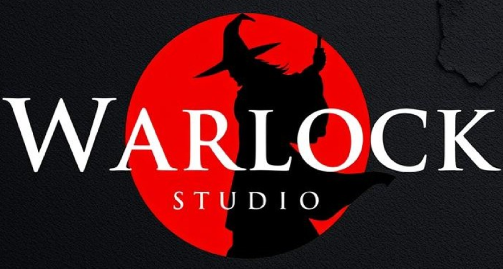
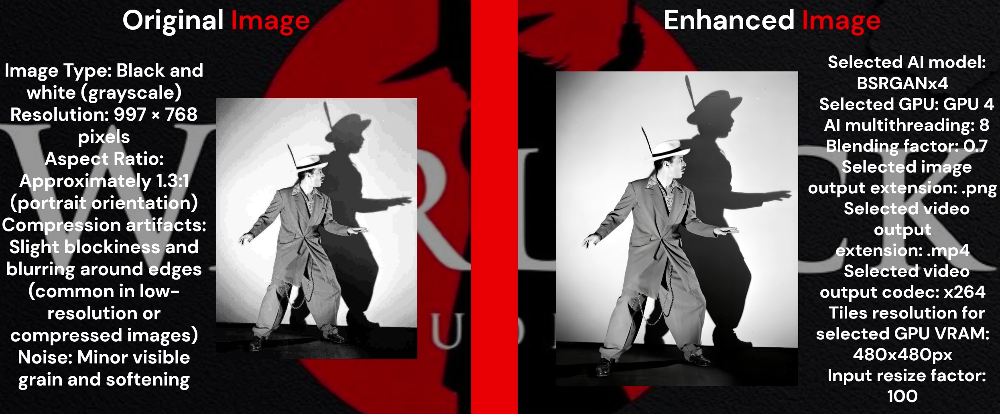

## **Download the installer** from our [WarlockHub](https://warlockhub-17vu0fo.gamma.site/warlockhub)

### AI-Powered Media Enhancement & Upscaling Suite 2.0

Warlock-Studio is an **open-source desktop application** that unifies the power of [**MedIA-Witch**](https://github.com/Ivan-Ayub97/MedIA-Witch.git) and [**MedIA-Wizard**](https://github.com/Ivan-Ayub97/MedIA-Wizard.git) into a single, seamless platform for AI-driven image and video enhancement. Featuring support for the latest upscaling, restoration, and interpolation models with a sleek, intuitive interface, Warlock-Studio brings professional-grade media processing to everyone.

Now with advanced **AI-based frame interpolation** (RIFE), support for **slow-motion video generation**, refined **GPU management**, and a more modular, scalable UI—Warlock-Studio 2.0 is built for the future of creative enhancement.

---

## Captures

- General UI

- RIFE Options UI

---

## Installation

Follow these steps to get up and running with Warlock-Studio:

1. **Run the installer** and follow the on-screen prompts.
2. **Launch the app:** open `Warlock-Studio.exe` on Windows.
3. **Start enhancing** your images and videos with a few clicks!

Warlock-Studio leverages [PyInstaller](https://www.pyinstaller.org/) and [Inno Setup](http://www.jrsoftware.org/isinfo.php) for effortless packaging and installation.

---

## Key Features

- **State-of-the-Art AI Models:**
  Real-ESRGAN, SRGAN, BSRGAN, IRCNN, Waifu2x, Anime4K, **RIFE** and more for noise reduction, resolution boost, high-fidelity restoration, and smooth frame interpolation.

- **AI Frame Interpolation & Slow Motion Generation:**
  Generate intermediate frames between existing video frames using RIFE. Create smooth **x2/x4/x8** transitions or cinematic slow motion effects.

- **Batch Processing:**
  Upscale, interpolate, and enhance multiple images or videos in one go—ideal for large collections.

- **Customizable Workflows:**
  Pick your AI model, output resolution, file format (PNG, JPEG, MP4, etc.), and quality settings to suit any project.

- **Intuitive UI:**
  A clean, user-friendly interface designed for both novices and pros—everything you need is a click away.

- **Open-Source & Extensible:**
  Licensed under the MIT License. Additional conditions are described in the [NOTICE](NOTICE) file.

---

## How to Use

1. **Run as Administrator** (optional but recommended for best performance).
2. **Load Media:** drag & drop images, videos, or folders into the app.
3. **Configure Settings:**

   - **Choose AI Model** (Real-ESRGAN, SRGAN, BSRGAN, IRCNN, Waifu2x, Anime4K, **RIFE**, etc.)
   - **Set Output Resolution**, **Format**, and optionally enable **interpolation** or **slow motion**

4. **Start Processing:** hit **Start** and let the magic happen.
5. **Retrieve Results:** the enhanced files will appear in your selected output folder.

---

## Quality Comparison

---

## System Requirements

- **OS:** Windows 10 or later
- **RAM:** 4 GB minimum (8 GB+ recommended)
- **GPU:** NVIDIA or DirectML-compatible GPU highly recommended for speed and compatibility
- **Storage:** Ample space for your media files and outputs

---

### Integrated Technologies & Licenses

| Technology    | License                          | Author / Maintainer                                     | Source Code / Homepage                                     |
| ------------- | -------------------------------- | ------------------------------------------------------- | ---------------------------------------------------------- |
| QualityScaler | MIT                              | [Djdefrag](https://github.com/Djdefrag)                 | [GitHub](https://github.com/Djdefrag/QualityScaler)        |
| RealScaler    | MIT                              | [Djdefrag](https://github.com/Djdefrag)                 | [GitHub](https://github.com/Djdefrag/RealScaler)           |
| FluidFrames   | MIT                              | [Djdefrag](https://github.com/Djdefrag)                 | [GitHub](https://github.com/Djdefrag/FluidFrames)          |
| Real-ESRGAN   | BSD 3-Clause / Apache 2.0        | [Xintao Wang](https://github.com/xinntao)               | [GitHub](https://github.com/xinntao/Real-ESRGAN)           |
| RealESRGAN-G  | BSD 3-Clause / Apache 2.0        | [Xintao Wang](https://github.com/xinntao)               | [GitHub](https://github.com/xinntao/Real-ESRGAN)           |
| RealESR-Anime | BSD 3-Clause / Apache 2.0        | [Xintao Wang](https://github.com/xinntao)               | [GitHub](https://github.com/xinntao/Real-ESRGAN)           |
| RealESR-Net   | BSD 3-Clause / Apache 2.0        | [Xintao Wang](https://github.com/xinntao)               | [GitHub](https://github.com/xinntao/Real-ESRGAN)           |
| RIFE          | Apache 2.0                       | [hzwer](https://github.com/hzwer)                       | [GitHub](https://github.com/megvii-research/ECCV2022-RIFE) |
| SRGAN         | CC BY-NC-SA 4.0 (Non-Commercial) | [TensorLayer Community](https://github.com/tensorlayer) | [GitHub](https://github.com/tensorlayer/srgan)             |
| BSRGAN        | Apache 2.0                       | [Kai Zhang](https://github.com/cszn)                    | [GitHub](https://github.com/cszn/BSRGAN)                   |
| IRCNN         | BSD / Other (Mixed)              | [Kai Zhang](https://github.com/cszn)                    | [GitHub](https://github.com/cszn/IRCNN)                    |
| Anime4K       | MIT                              | [Tianyang Zhang (bloc97)](https://github.com/bloc97)    | [GitHub](https://github.com/bloc97/Anime4K)                |
| ONNX Runtime  | MIT                              | [Microsoft](https://github.com/microsoft)               | [GitHub](https://github.com/microsoft/onnxruntime)         |
| PyTorch       | BSD 3-Clause                     | [Meta AI](https://pytorch.org/)                         | [GitHub](https://github.com/pytorch/pytorch)               |
| FFmpeg        | LGPL-2.1 / GPL (varies)          | [FFmpeg Team](https://ffmpeg.org/)                      | [Official Site](https://ffmpeg.org)                        |
| ExifTool      | Perl Artistic License 1.0        | [Phil Harvey](https://exiftool.org/)                    | [Official Site](https://exiftool.org/)                     |
| DirectML      | MIT                              | [Microsoft](https://github.com/microsoft/)              | [Official Site](https://github.com/microsoft/DirectML)     |
| Python        | Python Software Foundation (PSF) | [Python Software Foundation](https://www.python.org/)   | [Official Site](https://www.python.org)                    |
| PyInstaller   | GPLv2+                           | [PyInstaller Team](https://github.com/pyinstaller)      | [GitHub](https://github.com/pyinstaller/pyinstaller)       |
| Inno Setup    | Custom Inno License              | [Jordan Russell](http://www.jrsoftware.org/)            | [Official Site](http://www.jrsoftware.org/isinfo.php)      |

---

## Contributions

We welcome your contributions!

1. **Fork** the repo.
2. **Create a branch** for your feature or fix.
3. **Submit a Pull Request** with a clear description of your changes.

For bug reports, suggestions or questions, reach out at **[negroayub97@gmail.com](mailto:negroayub97@gmail.com)**.

Warlock-Studio combines cutting-edge AI with a powerful yet user-friendly interface—take your media to the next level! 🧙‍♂️

---

## License

© 2025 Iván Eduardo Chavez Ayub
Licensed under the MIT License. Additional conditions are described in the [NOTICE](NOTICE.md) file.
