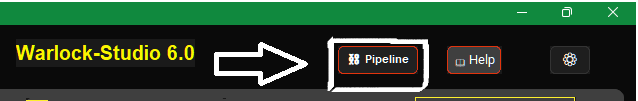
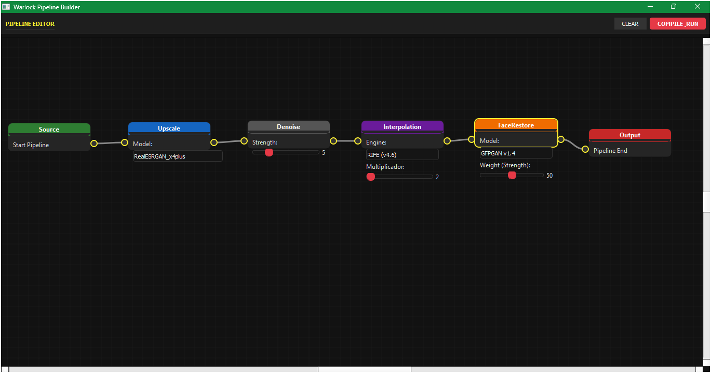

 

**Warlock-Studio** is a unified, high-performance platform for **upscaling, restoration, denoising, and frame interpolation**.
 
Inspired by [Djdefrag](https://github.com/Djdefrag) tools such as **QualityScaler** and **FluidFrames**.

---

## 📥 Download Installer

  

    This installer was built using <b>PyInstaller</b> and <b>Inno Setup</b>. 
    By default, it includes <b>DirectML</b> support to ensure maximum compatibility with any graphics card (NVIDIA/AMD/INTEL).
  

  

    Select your preferred option to download the latest version (Direct Release/Mirror):
  

<table align="center" style="width:100%; border-collapse:collapse; border:none;">
  <tr>
    </td>
    <td align="center" style="vertical-align:top; width:50%; border:none; padding:20px;">
      
    </td>
    <td align="center" style="vertical-align:top; width:50%; border:none; padding:20px;">
      
  </tr>
</table>

---

## ✨ What is New in v5.0

The **v5.0** release represents a foundational transformation of the application:

* **🧩 Modular Architecture:** The core has been re-engineered into specialized components (`core`, `preferences`, `console`, `drag_drop`) for superior stability and fault isolation.
* **🧠 NEO Engine:** A new diagnostic subsystem that scans CPU topology, RAM, and GPU VRAM to automatically recommend optimal tiling and thread settings.
* **🖥️ Integrated Debug Console:** A real-time GUI terminal that intercepts `stdout` and `stderr` with syntax highlighting, allowing users to diagnose FFmpeg or ONNX issues instantly.
* **⚡ Native CUDA & Failover:** The backend now strictly prioritizes **CUDA** (NVIDIA Optimized) > **DirectML** > **CPU**, with corrected integer typing for device IDs.
* **💎 Lossless Pipeline:** Deprecated `.jpg` usage in favor of `.png` for intermediate frames to prevent compression artifacts (blurriness).

---

## 🖼️ Interface Previews

  

 

### ⚙️ Preferences
[Preferences.webm](https://github.com/user-attachments/assets/933003de-7618-4ed4-8815-077c69bf1ebc)

---

## 🔍 Quality Comparison

[WsvideovsGit.webm](https://github.com/user-attachments/assets/c72f389d-827e-49b9-91b7-fd13e5b59f22)

[WsvideovsGit2.webm](https://github.com/user-attachments/assets/6695cce2-f42f-4955-8b43-56ec6d7b0bd2)

---

## ✨ Key Features

* **AI Upscaling & Restoration** – Utilize **Real-ESRGAN, BSRGAN, RealESRNet, RealESR_Animex4, and IRCNN** models for denoising, super-resolution, and detail recovery.
* **Face Restoration (GFPGAN)** – Recover facial details from low-resolution or blurry images and video frames.
* **Frame Interpolation (RIFE)** – Smooth motion or generate slow-motion content with **2×, 4×, or 8× interpolation**.
* **Advanced Hardware Acceleration** – Intelligent provider selection prioritizes **CUDA**, falls back to **DirectML**, and finally **CPU** for maximum compatibility.
* **Batch Processing** – Process multiple media files simultaneously, saving time and effort.
* **Custom Workflows** – Fine-grained control over models, resolution, output formats, and quality parameters.
* **Open-Source & Extensible** – Fully MIT licensed, for contributors and developers.

---

## 🖥️ System Requirements

| Component | Minimum Specification | Recommended Specification |
| :--- | :--- | :--- |
| **OS** | Windows 10 (64-bit) | Windows 11 (64-bit) |
| **RAM** | 8 GB | 16 GB+ (Recommended for 4K Video) |
| GPU | DirectX 12 Compatible | NVIDIA RTX 2060 / AMD RX 6700 XT | NVIDIA RTX 4070 Ti / AMD RX 7900 XT or better |
| **VRAM** | 4 GB | 8 GB+ (NEO Engine auto-tunes limits) |
| **Storage** | HDD Space | NVMe SSD (Highly recommended for RIFE) |

---

## 🚀 What's Next?

We are working on a **fundamental transformation** of how users create, manage, and execute pipelines within **Warlock-Studio**. The next major update introduces the **Visual Nodes** system, a powerful tool that will drastically improve the user experience and the complexity of the projects you can handle.

### 🖼️ New Module: `WSNodes` (Visual Node Editor)

The **`WSNodes`** module is an advanced visual node editor, built on **PyQt5**, that will allow users to:

* **Design Pipelines Intuitively:** Instead of directly editing JSON files, you will be able to drag, connect, and configure modules as if you were drawing a flowchart.
* **Simplified Visual Complexity:** Build complex, multi-step, and branching workflows in a clear and visual manner.
* **Reusability and Modularity:** Each node will encapsulate a specific function, allowing for easy reuse and simpler code maintenance.
* **Compilation and Execution:** Once designed, the editor will automatically compile the visual diagram into the internal pipeline format that **Warlock-Studio** already uses for execution.

**This represents a significant leap in Warlock-Studio's usability and capability, moving it towards a more flexible and visually powerful project development environment.**

---

## 🤝 Contributions

We welcome contributions from the community:

1.  **Fork** the repository.
2.  **Create a branch** for your feature or bug fix.
3.  **Submit a Pull Request** with a detailed description and testing notes.

📧 Contact: **[negroayub97@gmail.com](mailto:negroayub97@gmail.com)**

---

## 📜 License & Credits

© 2025 **Iván Eduardo Chavez Ayub**
 Licensed under **MIT**. Additional terms and attributions are provided in **NOTICE.md**.

### 📊 Integrated Technologies & Licenses

| Technology / Model | License | Author / Maintainer | Source |
| :--- | :--- | :--- | :--- |
| **Real-ESRGAN** | BSD 3-Clause | Xintao Wang | [GitHub](https://github.com/xinntao/Real-ESRGAN) |
| • RealESRGANx4 | BSD 3-Clause | Xintao Wang | Same as above |
| • RealESRNetx4 | BSD 3-Clause | Xintao Wang | Same as above |
| • RealESR_Gx4 (Custom Variant) | BSD 3-Clause | Xintao / Community | Same as above |
| • RealESR_Animex4 (Anime Model) | BSD 3-Clause | Community | Same as above |
| **BSRGAN** | Apache 2.0 | Kai Zhang | [GitHub](https://github.com/cszn/BSRGAN) |
| • BSRGANx4 | Apache 2.0 | Kai Zhang | Same as above |
| • BSRGANx2 | Apache 2.0 | Kai Zhang | Same as above |
| **IRCNN** | BSD / Mixed | Kai Zhang | [GitHub](https://github.com/cszn/IRCNN) |
| • IRCNN_Mx1 | BSD / Mixed | Kai Zhang | Same as above |
| • IRCNN_Lx1 | BSD / Mixed | Kai Zhang | Same as above |
| **GFPGAN** | Apache 2.0 | TencentARC | [GitHub](https://github.com/TencentARC/GFPGAN) |
| **RIFE** | Apache 2.0 | hzwer | [GitHub](https://github.com/megvii-research/ECCV2022-RIFE) |
| **QualityScaler** | MIT | Djdefrag | [GitHub](https://github.com/Djdefrag/QualityScaler) |
| **FluidFrames** | MIT | Djdefrag | [GitHub](https://github.com/Djdefrag/FluidFrames) |
| **ONNX Runtime** | MIT | Microsoft | [GitHub](https://github.com/microsoft/onnxruntime) |
| **FFmpeg** | LGPL / GPL | FFmpeg Team | [Official Site](https://ffmpeg.org) |
| **ExifTool** | Artistic | Phil Harvey | [Official Site](https://exiftool.org/) |
| **Python** | PSF License | Python Software Foundation | [Official Site](https://www.python.org) |
| **PyInstaller** | GPLv2+ | PyInstaller Team | [GitHub](https://github.com/pyinstaller/pyinstaller) |
| **Inno Setup** | Custom | Jordan Russell | [Official Site](http://www.jrsoftware.org/isinfo.php) |

