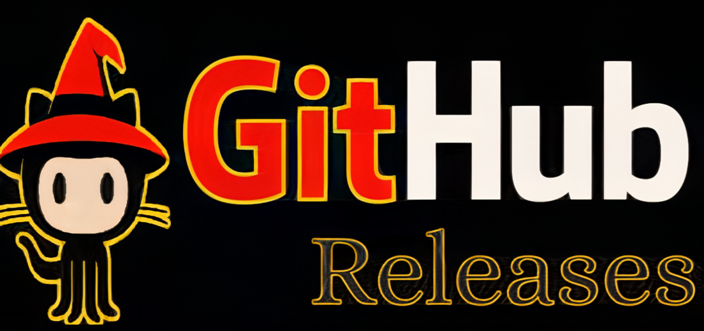
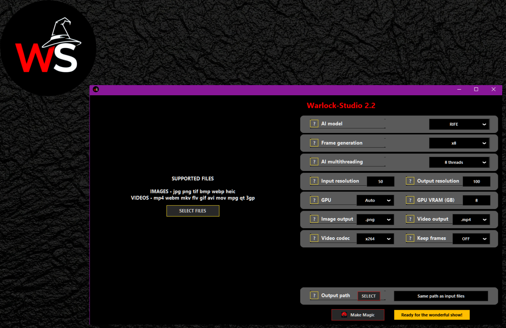
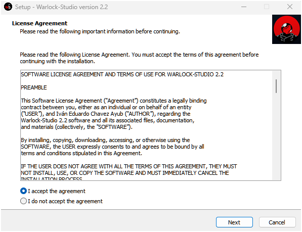
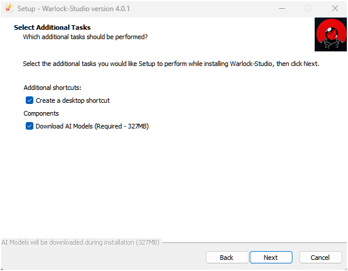

<p align="center">
  
  
</p>

AI Media Enhancement Suite

**Warlock-Studio** is a powerful, open-source desktop application for Windows that integrates state-of-the-art AI models for video and image enhancement. Inspired by the work of [Djdefrag](https://github.com/Djdefrag) on tools like **QualityScaler** and **FluidFrames**, this suite provides a unified, high-performance interface for upscaling, restoration, and frame interpolation.

Version 3.0 marks a major evolution, introducing **AI-powered face restoration**, a completely modernized user interface, and significant performance optimizations to deliver professional-grade results to everyone.

---

### ► Download Installer (v3.0)

Get the latest stable release from any of the following platforms:

<table>
  <tr>
    <td align="center" width="33%">
      <a href="https://sourceforge.net/p/warlock-studio/">
        
      </a>
    </td>
    <td align="center" width="33%">
      <a href="https://drive.google.com/file/d/1m_YKY612EaMiYyxJDRj1WsCmcJnCSKC7/view?usp=sharing">
        
      </a>
    </td>
    <td align="center" width="33%">
      <a href="https://github.com/Ivan-Ayub97/Warlock-Studio/releases/download/3.0/Warlock-Studio3.0Setup.zip">
        
      </a>
    </td>
  </tr>
</table>


---

## Key Features

- **State-of-the-Art AI Models**
  A comprehensive suite including Real-ESRGAN, BSRGAN, IRCNN, **GFPGAN**, and **RIFE** for denoising, resolution enhancement, detail restoration, and smooth frame interpolation.

- **AI Face Restoration (New in v3.0)**
  Restore and enhance faces in old, blurry, or low-quality photos and videos with the integrated GFPGAN model, bringing cherished memories back to life.

- **AI Frame Interpolation & Slow Motion**
  Generate new in-between frames using RIFE to create ultra-smooth **2x, 4x, or 8x** motion or dramatic slow-motion effects.

- **Modern & Intuitive Interface**
  Completely redesigned in v3.0 for a clean, efficient, and user-friendly experience for both beginners and professionals.

- **Batch Processing**
  Simultaneously process multiple images or videos—ideal for large-scale media projects.

- **Customizable Workflows**
  Choose your preferred AI model, output resolution, format (PNG, JPEG, MP4, etc.), and quality settings for full creative control.

- **Open-Source & Extensible**
  Licensed under the MIT License. Contributions are welcome! Additional usage terms can be found in the `NOTICE.md` file.

---

## What's New in Version 3.0

- ✅ **AI Face Restoration:** Added support for the GFPGAN model, enabling powerful face enhancement and repair.
- ✅ **Modernized UI/UX:** Implemented a complete visual redesign with a new, professional color scheme and improved components like a dynamic splash screen and scrollable message boxes.
- ✅ **Performance Optimisation:** Enhanced memory efficiency by using contiguous arrays and refining data type handling during AI processing, leading to faster and more stable performance.
- ✅ **Improved Codebase Health:** Refactored the core logic to be more modular by encapsulating face restoration in its own class (`AI_face_restoration`), improving maintainability.
- ✅ **Increased Robustness:** Added explicit handling for images with transparency (BGRA) to ensure compatibility with models that require 3-channel input (BGR).

---

## Interface Previews

### 🔹 Main View (v3.0)


### 🔹 RIFE Option



---

## How to Use

1. **Run as Administrator** (optional but recommended for optimal performance).

2. **Load Your Media**: Select your images and videos to import them into the app.

3. **Configure Settings**:

   - Select an **AI Model** (e.g., Real-ESRGAN, BSRGAN, GFPGAN, RIFE).
   - Set the **input/output resolution**, **file format**, and toggle features like **interpolation** or **blending**.

4. **Start Processing**: Click **"Make Magic"** to begin the enhancement.

5. **Retrieve Your Files**: Processed outputs will be saved in your chosen destination folder.

---

## Quality Comparison

**Comparison of an enhanced image using the BSRGANx2 model**


---

## Installation

To get started with Warlock-Studio:

1. **Download the installer** from the links at the top of this document.
2. **Run the installer** and follow the setup instructions.
3. **Launch the application** from the Start Menu or desktop shortcut.

Warlock-Studio uses [PyInstaller](https://www.pyinstaller.org/) and [Inno Setup](http://www.jrsoftware.org/isinfo.php) for a seamless packaging and installation experience.

### Installation Window Previews




---

## System Requirements

- **Operating System:** Windows 10 or later (64-bit)
- **Memory (RAM):** 8 GB or more recommended
- **Graphics Card:** NVIDIA or DirectML-compatible GPU highly recommended for performance
- **Storage:** Sufficient disk space for input and output media files

---

## Development Status — v3.0-07.25

| Component                           | Status            | Notes                                                                              |
| :---------------------------------- | :---------------- | :--------------------------------------------------------------------------------- |
| **Upscaling Models (ESRGAN, etc.)** | 🟢 **Stable**     | Fully integrated with dynamic VRAM recovery for enhanced stability.                |
| **Face Restoration (GFPGAN)**       | 🟢 **Stable**     | New feature for high-quality face enhancement.                                     |
| **Frame Interpolation (RIFE)**      | 🟢 **Stable**     | Includes slow-motion and intermediate frame generation capabilities.               |
| **Batch Processing**                | 🟢 **Stable**     | Reliable processing with improved error handling and resource management.          |
| **User Interface (UI/UX)**          | 🟢 **Modernized** | Complete thematic redesign with a professional color palette and improved dialogs. |
| **GPU Management**                  | 🟢 **Optimized**  | Dynamic VRAM error recovery and graceful hardware codec fallbacks.                 |
| **Installer and Packaging**         | 🟢 **Stable**     | Easy-to-use installer for Windows platforms.                                       |

---

## Project Structure

```
Warlock-Studio/
├──AI-onnx/
   │
   └──├──BSRGANx2_fp16.onnx
      ├──BSRGANx4_fp16.onnx
      ├──GFPGANv1.4.fp16.onnx
      ├──IRCNN_Lx1_fp16.onnx
      ├──IRCNN_Mx1_fp16.onnx
      ├──RealESR_Animex4_fp16.onnx
      ├──RealESR_Gx4_fp16.onnx
      ├──RealESRGANx4_fp16.onnx
      ├──RealESRNetx4_fp16.onnx
      ├──RealSRx4_Anime_fp16.onnx
      ├──RIFE_fp32.onnx
      └──RIFE_Lite_fp32.onnx
├──Assets/
   │
   └──├──banner.png
      ├──clear_icon.png
      ├──exiftool.exe
      ├──ffmpeg.exe
      ├──info_icon.png
      ├──logo.ico
      ├──logo.png
      ├──stop_icon.png
      ├──upscale_icon.png
      ├──wizard-image.bmp
      └──wizard-small.bmp
├──rsc/
   │
   └──├──badge-color.png
      ├──Capture.png
      ├──CaptureRIFE.png
      ├──google_drive-logo.png
      ├──WorkflowBSRGAN.png
      ├──WorkflowIRCNN.png
      ├──WorkflowRealESRGAN.png
      ├──WorkflowRIFE.png
      └──Installation_window2.png
├──Manual/
   │
   └──├──v3.0-User_Manual-EN.pdf
      ├──Manual_EN.tex
      ├──v3.0-User_Manual-ES.pdf
      └──Manual_ES.tex
│
├──CHANGELOG.md
├──CODE_OF_CONDUCT.md
├──CONTRIBUTING.md
├──LICENSE
├──License.txt
├──NOTICE.md
├──README.md                 # This File
├──SECURITY.md
├──Setup.iss
├──Manual_ES.pdf
├──Manual_EN.pdf
├──Warlock-Studio.py         # Main
└──Warlock-Studio.spec
```

---

## Integrated Technologies & Licenses

| Technology    | License                   | Author / Maintainer                                       | Source Code / Homepage                                     |
| :------------ | :------------------------ | :-------------------------------------------------------- | :--------------------------------------------------------- |
| QualityScaler | MIT                       | [Djdefrag](https://github.com/Djdefrag)                   | [GitHub](https://github.com/Djdefrag/QualityScaler)        |
| RealScaler    | MIT                       | [Djdefrag](https://github.com/Djdefrag)                   | [GitHub](https://github.com/Djdefrag/RealScaler)           |
| FluidFrames   | MIT                       | [Djdefrag](https://github.com/Djdefrag)                   | [GitHub](https://github.com/Djdefrag/FluidFrames)          |
| Real-ESRGAN   | BSD 3-Clause / Apache 2.0 | [Xintao Wang](https://github.com/xinntao)                 | [GitHub](https://github.com/xinntao/Real-ESRGAN)           |
| GFPGAN        | Apache 2.0                | [TencentARC / Xintao Wang](https://github.com/TencentARC) | [GitHub](https://github.com/TencentARC/GFPGAN)             |
| RIFE          | Apache 2.0                | [hzwer](https://github.com/hzwer)                         | [GitHub](https://github.com/megvii-research/ECCV2022-RIFE) |
| SRGAN         | CC BY-NC-SA 4.0           | [TensorLayer Community](https://github.com/tensorlayer)   | [GitHub](https://github.com/tensorlayer/srgan)             |
| BSRGAN        | Apache 2.0                | [Kai Zhang](https://github.com/cszn)                      | [GitHub](https://github.com/cszn/BSRGAN)                   |
| IRCNN         | BSD / Mixed               | [Kai Zhang](https://github.com/cszn)                      | [GitHub](https://github.com/cszn/IRCNN)                    |
| Anime4K       | MIT                       | [Tianyang Zhang (bloc97)](https://github.com/bloc97)      | [GitHub](https://github.com/bloc97/Anime4K)                |
| ONNX Runtime  | MIT                       | [Microsoft](https://github.com/microsoft)                 | [GitHub](https://github.com/microsoft/onnxruntime)         |
| PyTorch       | BSD 3-Clause              | [Meta AI](https://pytorch.org/)                           | [GitHub](https://github.com/pytorch/pytorch)               |
| FFmpeg        | LGPL / GPL (varies)       | [FFmpeg Team](https://ffmpeg.org/)                        | [Official Site](https://ffmpeg.org)                        |
| ExifTool      | Perl Artistic License     | [Phil Harvey](https://exiftool.org/)                      | [Official Site](https://exiftool.org/)                     |
| DirectML      | MIT                       | [Microsoft](https://github.com/microsoft/)                | [GitHub](https://github.com/microsoft/DirectML)            |
| Python        | PSF License               | [Python Software Foundation](https://www.python.org/)     | [Official Site](https://www.python.org)                    |
| PyInstaller   | GPLv2+                    | [PyInstaller Team](https://github.com/pyinstaller)        | [GitHub](https://github.com/pyinstaller/pyinstaller)       |
| Inno Setup    | Custom License            | [Jordan Russell](http://www.jrsoftware.org/)              | [Official Site](http://www.jrsoftware.org/isinfo.php)      |

---

## Contributions

We warmly welcome community contributions!

1. **Fork** this repository.
2. **Create a branch** for your feature or fix.
3. **Submit a Pull Request** with a detailed explanation of your changes.

For bug reports, feature suggestions, or inquiries, contact us at: **[negroayub97@gmail.com](mailto:negroayub97@gmail.com)**

---

## License

© 2025 Iván Eduardo Chavez Ayub
Distributed under the MIT License. Additional terms are available in the `NOTICE.md` file.
