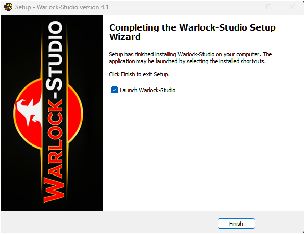

<div align="center">

### _AI Media Enhancement Suite_

[](https://github.com/Ivan-Ayub97/Warlock-Studio/releases)
[](https://github.com/Ivan-Ayub97/Warlock-Studio/releases/tag/4.1)
[](LICENSE)
[](https://github.com/Ivan-Ayub97/Warlock-Studio/releases)

_Transform your media with cutting-edge AI technology_

---

**Warlock-Studio** is an open source desktop application for **Windows**, designed to integrate state-of-the-art AI models for **image and video enhancement**.  
Inspired by [Djdefrag](https://github.com/Djdefrag) tools such as **QualityScaler** and **FluidFrames**, Warlock-Studio provides a unified, high-performance platform for **upscaling, restoration, denoising, and frame interpolation**.

Version **4.1** introduces **enhanced GPU utilization**, **robust ONNX model loading**, and multiple **stability and compatibility improvements**, ensuring a smoother, faster, and more reliable user experience.

---

## 📥 Download Installer (v4.1)

Get the latest stable release from:

<table>
  <tr>
    <td align="center">
      <a href="https://sourceforge.net/p/warlock-studio/">
        
      </a>
    </td>
    <td align="center">
      <a href="https://github.com/Ivan-Ayub97/Warlock-Studio/releases/download/v4.1/Warlock-Studio4.1Setup_Winx64.zip">
        
      </a>
    </td>
    <td align="center">
      <a href="https://ivanayub97.itch.io/warlock-studio">
        
      </a>
    </td>
  </tr>
</table>

---

## ✨ Key Features

- **AI Upscaling & Restoration** – Utilize **Real-ESRGAN, BSRGAN, and IRCNN** models for denoising, super-resolution, and detail recovery.  
- **Face Restoration (GFPGAN)** – Recover facial details from low-resolution or blurry images and video frames.  
- **Frame Interpolation (RIFE)** – Smooth motion or generate slow-motion content with **2×, 4×, or 8× interpolation**.  
- **Modern UI** – Redesigned interface in v4.0 for **intuitive workflow and streamlined navigation**.  
- **Batch Processing** – Process multiple media files simultaneously, saving time and effort.  
- **Custom Workflows** – Fine-grained control over models, resolution, output formats, and quality parameters.  
- **Open-Source & Extensible** – Fully MIT licensed, for contributors and developers.

---

## 🆕 What’s New in v4.1

- 🔧 **Removed outdated SuperResolution-10 model** to streamline resources.  
- ✅ **Enhanced ONNX loading** with better GPU acceleration.  
- ✅ **Fixed import and type annotation issues** for cleaner code execution.  
- ✅ **Improved error handling** with graceful fallback mechanisms.  
- 🟢 Optimized **GPU resource management** for faster processing.  
- 🚀 Compatibility fixes for **NumPy** and **OpenCV**.  
- 📦 Stability and memory usage improvements for longer sessions.  
- ✅ Increased startup reliability with enhanced user notifications.

---

## 🌐 Smart Model Distribution System (v4.0+)

### 🎯 Lightweight Installation
- Installer reduced from **1.4GB → 450MB** (–68%) for faster downloads.  
- Core AI models (~400MB) downloaded automatically on first launch.  
- Bandwidth-friendly and modular setup for selective installation.

### 🛡️ Reliability
- **Integrity checks** on downloaded model files.  
- **Graceful degradation** in case of missing models.  
- **Offline support** allows manual placement of model files.

---

## 🖼️ Interface Previews

**Main Window**  


**RIFE Options**  


---

## 🚀 How to Use

1. Run Warlock-Studio as **Administrator** (recommended for full GPU access).  
2. **Load Media** – Import images or videos.  
3. **Configure Processing Settings**:  
   - Select AI model (Real-ESRGAN, GFPGAN, etc.)  
   - Set resolution, format, frame interpolation, and quality.  
4. **Start Processing** using **"Make Magic"**.  
5. Retrieve the processed results from the designated output folder.

---

## 🖼️ Quality Comparison

Enhanced image using **BSRGANx2**:  


---

## 📊 Model Comparison

| Model File              | Use Case                                | Speed   | Quality | Notes |
|--------------------------|----------------------------------------|---------|---------|-------|
| **GFPGANv1.4**          | Face restoration                        | High    | High    | Optimal for portraits |
| **BSRGANx2**            | 2× upscale + denoising                  | Medium  | Very High | Suitable for lightly degraded media |
| **BSRGANx4**            | 4× upscale + denoising                  | Low     | Very High | For heavily degraded content |
| **RIFE**                | Frame interpolation                     | High    | High    | Smooth motion, slow-motion support |
| **RIFE-Lite**           | Lightweight interpolation               | Very High | Medium | Faster, lower resource usage |
| **RealESRGANx4**        | General 4× upscaling                    | Medium  | High    | Balanced performance |
| **RealESRNetx4**        | Subtle restoration                      | Medium  | High    | Preserves natural image texture |
| **RealSRx4_Anime**      | Anime / line-art enhancement            | Medium  | High    | Sharp edges for 2D art |
| **IRCNN_L**             | Light denoising                          | High    | Medium  | Mild artifact removal |
| **IRCNN_M**             | Medium denoising                         | High    | Medium  | Stronger artifact cleanup |

---

## ⚙️ Installation

1. **Download installer** (see links above).  
2. Run the **setup wizard** and follow prompts.  
3. Launch via Start Menu or Desktop shortcut.  

> Warlock-Studio is packaged using **PyInstaller** and deployed with **Inno Setup** for seamless installation.

### Installer Previews

  
  
  

---

## 🖥️ System Requirements

- **OS:** Windows 10 or higher (64-bit)  
- **RAM:** 8GB+ recommended  
- **GPU:** NVIDIA or DirectML-compatible GPU recommended  
- **Storage:** Sufficient free space for input and processed media  

---

## 📌 Development Status (v4.1-08.01)

| Component                  | Status      | Notes |
|-----------------------------|------------|-------|
| Upscaling Models            | 🟢 Stable  | Includes VRAM recovery integration |
| Optimized Model Suite       | 🟢 Enhanced | Streamlined and reliable |
| Face Restoration (GFPGAN)   | 🟢 Stable  | High-quality face reconstruction |
| Frame Interpolation (RIFE)  | 🟢 Stable  | Smooth motion and slow-motion support |
| Batch Processing            | 🟢 Stable  | Improved error handling and logging |
| User Interface (UI/UX)      | 🟢 Refined | Clean, modern design with integrated models |
| GPU Management              | 🟢 Enhanced | Robust ONNX handling and fallbacks |
| Code Quality                | 🟢 Improved | Refactored, type-safe, maintainable |
| Installer & Packaging       | 🟢 Stable  | Smooth setup experience |

---

## 📂 Project Structure
</div>

```
Warlock-Studio/
├── AI-onnx/                          # Pre-trained ONNX models for AI processing
│   ├── BSRGANx2_fp16.onnx
│   ├── BSRGANx4_fp16.onnx
│   ├── GFPGANv1.4.fp16.onnx
│   ├── IRCNN_Lx1_fp16.onnx
│   ├── IRCNN_Mx1_fp16.onnx
│   ├── RealESR_Animex4_fp16.onnx
│   ├── RealESR_Gx4_fp16.onnx
│   ├── RealESRGANx4_fp16.onnx
│   ├── RealESRNetx4_fp16.onnx
│   ├── RealSRx4_Anime_fp16.onnx
│   ├── RIFE_fp32.onnx
│   └── RIFE_Lite_fp32.onnx
│
├── Assets/                           # Application assets and third-party binaries
│   ├── banner.png
│   ├── clear_icon.png
│   ├── exiftool.exe
│   ├── ffmpeg.exe
│   ├── info_icon.png
│   ├── logo.ico
│   ├── logo.png
│   ├── stop_icon.png
│   ├── upscale_icon.png
│   ├── wizard-image.bmp
│   └── wizard-small.bmp
│
├── rsc/                              # UI previews, workflows, and branding resources
│   ├── itch.io.png
│   ├── Capture.png
│   ├── CaptureRIFE.png
│   ├── GitHub_Logo_WS.png
│   ├── WorkflowBSRGAN.png
│   ├── WorkflowIRCNN.png
│   ├── WorkflowRealESRGAN.png
│   ├── WorkflowRIFE.png
│   ├── Installation_window.png
│   ├── Installation_window2.png
│   └── Installation_window3.png
│
├── Manual/                           # LaTeX sources and generated manuals
│   ├── Manual_EN.tex
│   ├── Manual_ES.tex
│   ├── v4.1_User_Manual_EN.pdf
│   └── v4.1_User_Manual_ES.pdf
│
├── Warlock-Studio.py                 # Main application script
├── Warlock-Studio.spec               # PyInstaller specification file
├── Setup.iss                         # Inno Setup installer script
├── README.md                         # Project overview
├── requirements.txt                  # Python dependencies
├── CHANGELOG.md                      # Version history and updates
├── LICENSE                           # MIT License information
├── model_downloader.py               # Still in the process of implementation
├── NOTICE.md                         # Legal notices and attributions
├── CODE_OF_CONDUCT.md                # Contributor guidelines
├── CONTRIBUTING.md                   # Contribution guide
└── SECURITY.md                       # Security reporting policies
```
<div align="center">

## 📊 Integrated Technologies & Licenses

| Technology      | License               | Author / Maintainer                       | Source |
|-----------------|---------------------|------------------------------------------|--------|
| QualityScaler | MIT                   | [Djdefrag](https://github.com/Djdefrag)   | [GitHub](https://github.com/Djdefrag/QualityScaler)        |
| RealScaler    | MIT                   | [Djdefrag](https://github.com/Djdefrag)   | [GitHub](https://github.com/Djdefrag/RealScaler)           |
| FluidFrames   | MIT                   | [Djdefrag](https://github.com/Djdefrag)   | [GitHub](https://github.com/Djdefrag/FluidFrames)          |
| Real-ESRGAN     | BSD 3-Clause / Apache | Xintao Wang                               | [GitHub](https://github.com/xinntao/Real-ESRGAN) |
| GFPGAN          | Apache 2.0           | TencentARC / Xintao Wang                  | [GitHub](https://github.com/TencentARC/GFPGAN) |
| RIFE            | Apache 2.0           | hzwer                                     | [GitHub](https://github.com/megvii-research/ECCV2022-RIFE) |
| BSRGAN          | Apache 2.0           | Kai Zhang                                 | [GitHub](https://github.com/cszn/BSRGAN) |
| IRCNN           | BSD / Mixed          | Kai Zhang                                 | [GitHub](https://github.com/cszn/IRCNN) |
| Anime4K         | MIT                  | bloc97                                    | [GitHub](https://github.com/bloc97/Anime4K) |
| ONNX Runtime    | MIT                  | Microsoft                                 | [GitHub](https://github.com/microsoft/onnxruntime) |
| PyTorch         | BSD 3-Clause         | Meta AI                                   | [GitHub](https://github.com/pytorch/pytorch) |
| FFmpeg          | LGPL / GPL           | FFmpeg Team                               | [Official Site](https://ffmpeg.org) |
| ExifTool        | Artistic License     | Phil Harvey                               | [Official Site](https://exiftool.org/) |
| DirectML        | MIT                  | Microsoft                                 | [GitHub](https://github.com/microsoft/DirectML) |
| Python          | PSF License          | Python Software Foundation                | [Official Site](https://www.python.org) |
| PyInstaller     | GPLv2+               | PyInstaller Team                           | [GitHub](https://github.com/pyinstaller/pyinstaller) |
| Inno Setup      | Custom               | Jordan Russell                             | [Official Site](http://www.jrsoftware.org/isinfo.php) |

---

## 🤝 Contributions

We welcome contributions from the community:

1. **Fork** the repository.  
2. **Create a branch** for your feature or bug fix.  
3. **Submit a Pull Request** with detailed description and testing notes.  

📧 Contact: **[negroayub97@gmail.com](mailto:negroayub97@gmail.com)**  

---

## 📜 License

© 2025 Iván Eduardo Chavez Ayub  
Licensed under **MIT**. Additional terms and attributions are provided in `NOTICE.md`.  

</div>


