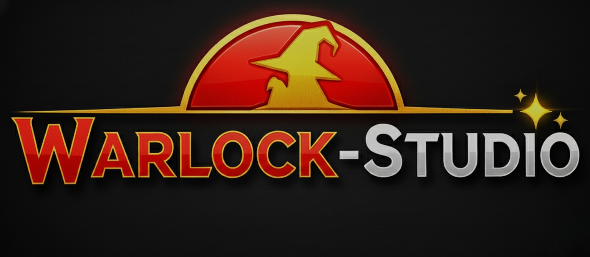
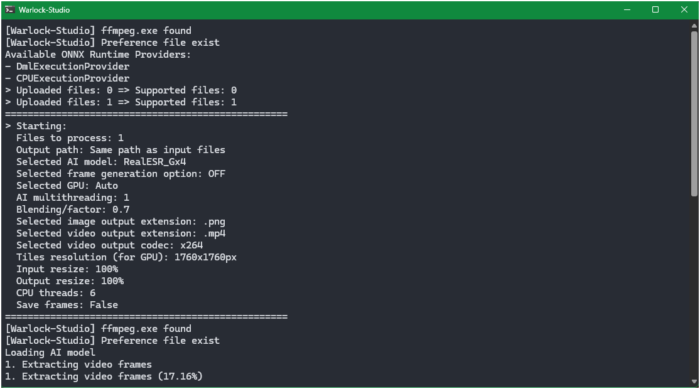

<div align="center">

### _AI Media Enhancement Suite_

[](https://github.com/Ivan-Ayub97/Warlock-Studio/releases)
[](https://github.com/Ivan-Ayub97/Warlock-Studio/releases/tag/4.2)
[](LICENSE)
[](https://github.com/Ivan-Ayub97/Warlock-Studio/releases)

[](#)
[](https://www.python.org/)
[](https://github.com/Ivan-Ayub97/Warlock-Studio/issues)
[](https://github.com/Ivan-Ayub97/Warlock-Studio/commits/main)


_Transform your media with cutting-edge AI technology_

---

**Warlock-Studio** is an open-source desktop application for **Windows**, designed to integrate state-of-the-art AI models for **image and video enhancement**.
Inspired by [Djdefrag](https://github.com/Djdefrag) tools such as **QualityScaler** and **FluidFrames**, Warlock-Studio provides a unified, high-performance platform for **upscaling, restoration, denoising, and frame interpolation**.

Version **4.2** introduces a **full offline installer**, an **advanced ONNX Runtime engine** with DirectML & CUDA support, and significant **packaging optimizations**, ensuring the most reliable and performant experience yet.

---

## 📥 Download Installer (v4.2)

Get the latest stable release from:

<table>
  <tr>
    <td align="center">
      <a href="https://sourceforge.net/p/warlock-studio/">
        
      </a>
    </td>
    <td align="center">
      <a href="https://github.com/Ivan-Ayub97/Warlock-Studio/releases/download/v4.2/Warlock-Studio-v4.2-Setup.exe">
        
      </a>
    </td>
  </tr>
</table>

---

## ✨ Key Features

-   **AI Upscaling & Restoration** – Utilize **Real-ESRGAN, BSRGAN, and IRCNN** models for denoising, super-resolution, and detail recovery.
-   **Face Restoration (GFPGAN)** – Recover facial details from low-resolution or blurry images and video frames.
-   **Frame Interpolation (RIFE)** – Smooth motion or generate slow-motion content with **2×, 4×, or 8× interpolation**.
-   **Advanced Hardware Acceleration** – Intelligent provider selection prioritizes **CUDA**, falls back to **DirectML**, and finally **CPU** for maximum compatibility and performance.
-   **Batch Processing** – Process multiple media files simultaneously, saving time and effort.
-   **Custom Workflows** – Fine-grained control over models, resolution, output formats, and quality parameters.
-   **Open-Source & Extensible** – Fully MIT licensed, for contributors and developers.

---

## 🆕 What’s New in v4.2

-   📦 **Full Offline Installer**: The application is now distributed as a single, self-contained offline installer. All AI models are included, eliminating the need for an internet connection during setup and ensuring a reliable installation.
-   🚀 **Advanced ONNX Runtime Engine**: The model loading architecture was re-engineered to intelligently prioritize hardware acceleration providers (**CUDA** > **DirectML** > **CPU**), maximizing performance on capable hardware and ensuring stability via a robust fallback mechanism.
-   ⚙️ **Aggressive Packaging Optimization**: The final application size has been drastically reduced by aggressively pruning unnecessary dependencies from the PyInstaller build, resulting in a lighter and more efficient package.
-   🐛 **Enhanced Runtime Stability**: Added crucial hidden imports to the build process, preventing `ModuleNotFoundError` crashes and ensuring all components of `onnxruntime` and other libraries load correctly.
-   🖥️ **Improved Debugging Experience**: The application now runs with an attached console window, providing real-time logs and error messages for easier troubleshooting.
-   ✨ **Professional Splash Screen**: A new startup splash screen provides immediate visual feedback while the application initializes, improving the user experience.

---

## 🖼️ Interface Previews

**Main Window**


**Console**


---

## 🚀 How to Use

1.  Run Warlock-Studio as **Administrator** (recommended for full GPU access).
2.  **Load Media** – Import images or videos.
3.  **Configure Processing Settings**:
    -   Select AI model (Real-ESRGAN, GFPGAN, etc.)
    -   Set resolution, format, frame interpolation, and quality.
4.  **Start Processing** using **"Make Magic"**.
5.  Retrieve the processed results from the designated output folder.

---

## 🖼️ Quality Comparison

Enhanced image using **BSRGANx2**:


---

## 📊 Model Comparison

| Model File                 | Use Case                       | Speed     | Quality   | Notes                               |
| -------------------------- | ------------------------------ | --------- | --------- | ----------------------------------- |
| **GFPGANv1.4** | Face restoration               | High      | High      | Optimal for portraits               |
| **BSRGANx2** | 2× upscale + denoising         | Medium    | Very High | Suitable for lightly degraded media |
| **BSRGANx4** | 4× upscale + denoising         | Low       | Very High | For heavily degraded content        |
| **RIFE** | Frame interpolation            | High      | High      | Smooth motion, slow-motion support  |
| **RIFE-Lite** | Lightweight interpolation      | Very High | Medium    | Faster, lower resource usage        |
| **RealESRGANx4** | General 4× upscaling           | Medium    | High      | Balanced performance                |
| **RealESRNetx4** | Subtle restoration             | Medium    | High      | Preserves natural image texture     |
| **RealSRx4_Anime** | Anime / line-art enhancement   | Medium    | High      | Sharp edges for 2D art              |
| **IRCNN_L** | Light denoising                | High      | Medium    | Mild artifact removal               |
| **IRCNN_M** | Medium denoising               | High      | Medium    | Stronger artifact cleanup           |

---

## ⚙️ Installation

1.  **Download the Full Offline Installer** (see links above).
2.  Run the **setup wizard** and follow the prompts.
3.  Launch via Start Menu or Desktop shortcut.

> Warlock-Studio is packaged using **PyInstaller** and deployed with **Inno Setup** for a seamless, self-contained installation experience.

---

## 🖥️ System Requirements

-   **OS:** Windows 11 or higher (64-bit)
-   **RAM:** 8GB+ recommended
-   **GPU:** NVIDIA (for CUDA), AMD, or Intel GPU with up-to-date drivers recommended
-   **Storage:** Sufficient free space for input and processed media

---

## 📌 Development Status (v4.2)

| Component                    | Status      | Notes                                                    |
| ---------------------------- | ----------- | -------------------------------------------------------- |
| ONNX Runtime Engine          | 🟢 Enhanced | Prioritizes CUDA > DirectML > CPU with automatic fallback. |
| Installer & Packaging        | 🟢 Overhauled | Full offline installer; heavily optimized package size.    |
| Upscaling Models             | 🟢 Stable   | Includes VRAM recovery integration.                      |
| Face Restoration (GFPGAN)    | 🟢 Stable   | High-quality face reconstruction.                        |
| Frame Interpolation (RIFE)   | 🟢 Stable   | Smooth motion and slow-motion support.                   |
| Batch Processing             | 🟢 Stable   | Improved error handling and logging.                     |
| User Interface (UI/UX)       | 🟢 Refined  | Clean, modern design with splash screen.                 |
| Code Quality                 | 🟢 Improved | Refactored, modular, and more maintainable.              |

---

## 📂 Project Structure
</div>

```
Warlock-Studio/
├── AI-onnx/                          # Pre-trained ONNX models for AI processing
│   ├── BSRGANx2_fp16.onnx
│   ├── BSRGANx4_fp16.onnx
│   ├── GFPGANv1.4.fp16.onnx
│   ├── IRCNN_Lx1_fp16.onnx
│   ├── IRCNN_Mx1_fp16.onnx
│   ├── RealESR_Animex4_fp16.onnx
│   ├── RealESR_Gx4_fp16.onnx
│   ├── RealESRGANx4_fp16.onnx
│   ├── RealESRNetx4_fp16.onnx
│   ├── RealSRx4_Anime_fp16.onnx
│   ├── RIFE_fp32.onnx
│   └── RIFE_Lite_fp32.onnx
│
├── Assets/                           # Application assets and third-party binaries
│   ├── banner.png
│   ├── clear_icon.png
│   ├── exiftool.exe
│   ├── ffmpeg.exe
│   ├── info_icon.png
│   ├── logo.ico
│   ├── logo.png
│   ├── stop_icon.png
│   ├── upscale_icon.png
│   ├── wizard-image.bmp
│   └── wizard-small.bmp
│
├── rsc/                              # UI previews and branding resources
│   ├── Capture.png
│   ├── image_comparison.png
│   ├── CaptureCONSOLE.png
│   └── GitHub_Logo_WS.png
│
├── Warlock-Studio.py                 # Main application script
├── Warlock-Studio.spec               # PyInstaller specification file
├── Setup.iss                         # Inno Setup installer script
├── README.md                         # Project overview
├── CHANGELOG.md                      # Version history and updates
├── LICENSE                           # MIT License information
├── NOTICE.md                         # Legal notices and attributions
├── CODE_OF_CONDUCT.md                # Contributor guidelines
├── CONTRIBUTING.md                   # Contribution guide
└── SECURITY.md                       # Security reporting policies
```
<div align="center">

---

## 📊 Integrated Technologies & Licenses

| Technology      | License             | Author / Maintainer                      | Source                                                       |
| --------------- | ------------------- | ---------------------------------------- | ------------------------------------------------------------ |
| QualityScaler   | MIT                 | [Djdefrag](https://github.com/Djdefrag)  | [GitHub](https://github.com/Djdefrag/QualityScaler)          |
| FluidFrames     | MIT                 | [Djdefrag](https://github.com/Djdefrag)  | [GitHub](https://github.com/Djdefrag/FluidFrames)            |
| Real-ESRGAN     | BSD 3-Clause / Apache | Xintao Wang                              | [GitHub](https://github.com/xinntao/Real-ESRGAN)             |
| GFPGAN          | Apache 2.0          | TencentARC / Xintao Wang                 | [GitHub](https://github.com/TencentARC/GFPGAN)               |
| RIFE            | Apache 2.0          | hzwer                                    | [GitHub](https://github.com/megvii-research/ECCV2022-RIFE) |
| BSRGAN          | Apache 2.0          | Kai Zhang                                | [GitHub](https://github.com/cszn/BSRGAN)                     |
| IRCNN           | BSD / Mixed         | Kai Zhang                                | [GitHub](https://github.com/cszn/IRCNN)                      |
| ONNX Runtime    | MIT                 | Microsoft                                | [GitHub](https://github.com/microsoft/onnxruntime)           |
| FFmpeg          | LGPL / GPL          | FFmpeg Team                              | [Official Site](https://ffmpeg.org)                          |
| ExifTool        | Artistic License    | Phil Harvey                              | [Official Site](https://exiftool.org/)                       |
| Python          | PSF License         | Python Software Foundation               | [Official Site](https://www.python.org)                      |
| PyInstaller     | GPLv2+              | PyInstaller Team                         | [GitHub](https://github.com/pyinstaller/pyinstaller)         |
| Inno Setup      | Custom              | Jordan Russell                           | [Official Site](http://www.jrsoftware.org/isinfo.php)      |

---

## 🤝 Contributions

We welcome contributions from the community:

1.  **Fork** the repository.
2.  **Create a branch** for your feature or bug fix.
3.  **Submit a Pull Request** with a detailed description and testing notes.

📧 Contact: **[negroayub97@gmail.com](mailto:negroayub97@gmail.com)**

---

## 📜 License

© 2025 Iván Eduardo Chavez Ayub
Licensed under **MIT**. Additional terms and attributions are provided in `NOTICE.md`.

</div>


